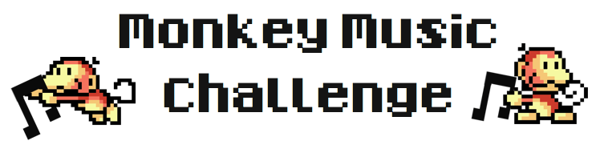

Introduction
============

The Spotify backend is consists of a multitude of individual services.  One
such service is the music recommendation service, which is responsible for
finding and recommending new tracks to Spotify users, according to their music 
taste.

The music recommendation service has lately been getting some pretty negative
feedback from users. The word out on Twitter is that even monkeys could find
better music recommendations!

Therefore, upper management has made an informed decision that the next version
of the music recommendation service shall be operated entirely by monkeys. As
product manager for the music recommendation service, your job is to make sure
that the monkeys do a good job. 

You have therefore decided to write a computer program that helps monkeys find
good track recommendations for Spotify users.

This is all entirely fictional of course.
{: .tip}

Task summary
============

The task consists of implementing a program to play the Monkey Music game.
The goal of the game is to score points by gathering track recommendations and
giving them to a Spotify user.

The game
========

Every game of Monkey Music is broken up into a number of turns. 

Every turn, your program will be executed and fed information about the current
 state of the level by reading from `stdin`. Your program responds by printing 
one command to `stdout`. The command decides what your monkey does during the c
urrent turn.

Fate decides the order in which monkeys execute their commands in a turn.
{: .tip}

Before every turn, execution of your program starts. After every turn, executio
n of your program stops.

Rules
-----

### Scoring

Your monkey will pick up tracks and deliver them to a user. 

When a track is delivered, you will recieve a score according to how well the t
rack fits the music taste of the user.  The player with the highest score at th
e end of the game will be the winner.

You should try to get as high a score as possible.
{. tip}

### Turn limit

Every game is played for a limited amount of turns. This limit is different for
 different levels.

The game ends when the turn limit is reached.

### Time limit

Every time your program is executed, the execution time will be measured. Every
 level has a total time limit, that your program should not exceed.

If your execution time reaches the time limit, your monkey will run out of ener
gy and fall asleep for `5` turns. Afte sleeping for `5` turns, the remaining ex
ecution time of your program will be replenished.

### Carrying capacity

The number of tracks your monkey can pick up and hold at any given time is call
ed carrying capacity.

The carrying capacity of your monkey is different for every level.

Game progression
----------------

### Initialization phase

The game consists of two different phases.

The first phase is the initialization phase, it occurs once every game.

During the initialization phase, your program will be given information about 
the level that will be useful during the entire course of the game.

The information that can be read from `stdin` during the `init` phase is:

* The string `"INIT"`
* The id of your monkey
* The `width` of the map
* The `height` of the map
* The `turn limit` of the game
* The `toplists` of the user

After the initialization phase, execution of your program will stop until the next phase.

Make sure to keep the data from the initialization phase in a persistent cache!
{: .tip}

### Turn phases

After the initialization phase, a number of turn phases will follow. 

The total number of turn phases is decided by the turn limit of the level.

The information that can be read from `stdin` during a turn phase is:

* The string `"TURN"`
* The turn number
* The remaining carrying capacity of your monkey
* The remaining execution time of your program
* Results from metadata lookups from the previous phase
* The current state of the level

After reading the turn information from `stdin`, your program will print a comm
and for your monkey to `stdout`.

Level layout
------------

The level is a `n x m` grid of cells. It is sent to the standard input of your
program. 

Each cell contains one of the following things:

### Monkeys

* ASCII: `M[id]`

You, and your competitors each have your own monkey to control. 
Every monkey is identified by a unique numerical id.

### Walls

* ASCII: `#`

Walls are inanimate objects that monkeys cannot pass through.

### Tracks

* ASCII: `[URI]`

Tracks are identified by their unique Spotify URI. Every track URI starts with `spotify:track:`, 
followed by `22` alphanumerical characters. Example: `spotify:track:5H85hOp2oMlhMh9JlkdJP2`.
Tracks can be picked up and carried around by monkeys.

### The User

* ASCII: `U`

The user is where monkeys deliver their track recommendations. Monkeys are scored for every track
delivered to the user according to how well the track fits the user's music taste.

### Empty

* ASCII: `[SPACE]`

Nothing to do here.

A cell can only contain one thing at any time.
{: .tip}

User toplists
-------------

How well track matches the music taste of a user is decided by the user's toplists.

Every Spotify user has a track toplist, an album toplist and an artist toplist. Every entry 
in a toplist is a comma-separated string of metadata.

The toplists are sent to the standard input of your program on the following formats:

### Track toplist

First an integer `n`, followed by `n` lines of track metadata entries.

    n
    track,album,artist,year
    track,album,artist,year
    ...

### Album toplist

First an integer `n`, followed by `n` lines of album metadata entries.

    n
    album,artist,year
    album,artist,year
    ...

### Artist toplist

First an integer `n`, followed by `n` lines of artist metadata entries.

    n
    artist
    artist
    ...

### Disliked artist toplist

You will also receive a list of artists that the user does not like.

First an integer `n`, followed by `n` lines of artist entries.

    n
    artist
    artist
    ...

Spotify does not actually keep toplists of disliked artists.
{: .tip}

Score system
------------

Each track is scored according to the user toplists by placing it into 1 out of
 5 score tiers.

There are three positive tiers: `1`, `2` and `3`. There are two negative tiers,
 `-1` and `-2`

The following criteria decide which tier a track belongs to:

### Tier -2: Disliked artist

To recommend a track whose `artist` is among the user's disliked artist toplist
 is simply an epic fail.

### Tier -1: "Sönderlyssnad" 

When the `track` is already in the user's track toplist, there is not much
point in recommending it, is there?

### Tier += 1: Favorite artist

If the `artist` of the track is in the user's artist toplist, the track
will be bumped up one tier.

### Tier += 1: Favorite album

If the `album` of the track is in the user's album toplist, the track
will be bumped up one tier.

### Tier += 1: Favorite decade

This is an interesting one. Every user has a top decade, which is the
decade that is most prominent in the user's track toplist and album toplist.

If the `year` of the track belongs to the user's top decade, the track
will be bumped up one tier.

### Tally

Your track will be scored according to it's tier:

* Tier -2: -16 points
* Tier -1: -4 points
* Tier 1: 4 points
* Tier 2: 16 points
* Tier 3: 64 points

Tier 3 tracks are obviously very valuable, so be on the lookout for
these.
{: .tip}

Monkey commands
---------------

Commands are sent from the standard output of your program. 
In each turn of the game, every monkey executes one command. 

Commands which the monkeys can execute are:

### Move west

* ASCII: `W`

Moves the monkey one cell to the left.

### Move east

* ASCII: `E`

Moves the monkey one cell to the right.

### Move north

* ASCII: `N`

Moves the monkey one cell up.

### Move down

* ASCII: `N`

Moves the monkey one cell down.

### Metadata lookup

* ASCII: `[URI]`

Queries the metadata for a track URI. You will recieve the metadata the following turn.

### Boost

* ASCII: `B,[COMMAND],[COMMAND],[COMMAND]`

Once every game, the monkey can issue a boost command and then issue three
other comma separated commands during the same turn.

Your monkey must every turn choose between moving and looking up the metadata of a track!
{: .tip}

### Picking up tracks

When standing next to a track and executing a move command toward the track, your monkey will
remain in the same cell and pick up the track. If the carrying capacity of your monkey is maxed
out, nothing will happen.

Once a track is picked up, there is no way to get rid of it but to deliver it.
{: .tip}

### Delivering tracks

When standing next to the user and issuing a move command toward the track, your monkey will
remain in the same cell and deliver all currently carried tracks to the user. You will then
recieve score according to the score system.

Be careful about picking up negative tier tracks. You'll have to deliver them.

Protocol specification
======================

Input
-----

### Initialization

    INIT
    M[id]
    [WIDTH]
    [HEIGHT]
    [TURN LIMIT]
    [n]
    [TRACK],[ALBUM],[ARTIST],[YEAR]
    [n]
    [ALBUM],[ARTIST],[YEAR]
    [n]
    [ARTIST]

### Turn
  
    TURN
    M[ID]
    [TURN NUMBER]
    [REMAINING CAPACITY]
    [REMAINING TIME]
    [n]
    [URI],[TRACK],[ALBUM],[ARTIST],[YEAR]
    [LEVEL]

Output
------

    [DIRECTION]|[URI]|B,[COMMAND],[COMMAND],[COMMAND]

Examples
--------

#### Move west

The following command will result in your monkey moving one step to the
east during the turn:
  
    `W`

#### Track lookup

The following command will result in a track metadata query:

    `spotify:track:5H85hOp2oMlhMh9JlkdJP2`

Your monkey will not move during the turn.

The next turn, the requested track metadata can be read from
the turn input.

#### Boost

The following command:

    `B,W,spotify:track:5H85hOp2oMlhMh9JlkdJP2,E`

will result in the monkey moving one step west, one step to the east, and
looking up the metadata of one track during one turn.

### Initialization

### Turn (without metadata)

### Turn (with metadata)

### Turn (after boost)

The turn input after having issued this command:

    `B,W,spotify:track:5H85hOp2oMlhMh9JlkdJP2,spotify:track:5H85hOp2oMlhMh9JlkdJP2`

could look like:

    TURN
    10
    M2
    1
    4529
    2
    spotify:track:5H85hOp2oMlhMh9JlkdJP2,TODO,TODO,TODO,TODO
    spotify:track:5H85hOp2oMlhMh9JlkdJP2,TODO,TODO,TODO,TODO

Getting started
===============

Requirements
------------

Monkey Music depends on Ruby 1.9. 

If your OS does not provide it by default, you can always get it using RVM.

Installation
------------

To install the challenge runtime:

    > gem install monkeymusic

To get started quickly:

    > monkeymusic demo

To see something on the screen:

    > monkeymusic -p demo_player

You can probably learn a lot about the game from reading the `demo_player`.

Handing in
==========

Your competition entry is to be handed in as a zip archive containing
everything needed to run your program.

When unpacked, your program should be runned through an executable file
called `runme`. This file should be put into a subfolder.
